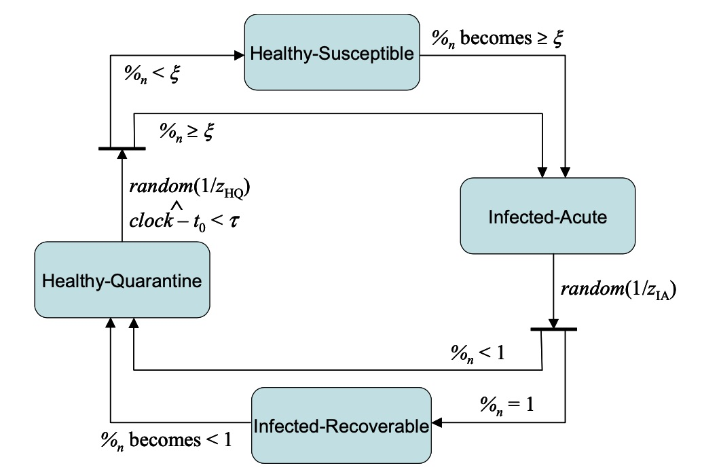

# Application of blockchain and infection processes in graphs to mitigate content poisoning attacks in information-centric networks

Source code for simulating infection processes in graphs to mitigate content poisoning attacks in ICNs.
In simpler words "How to prevent content forgery caused by stolen private key?".

This repo is a source code behind my [Master's Thesis](https://www.researchgate.net/publication/344659633_Application_of_blockchain_and_infection_processes_in_graphs_to_mitigate_content_poisoning_attacks_in_information-centric_networks).



## Visual Simulation


visit [masti.stasbar.com](https://masti.stasbar.com)

## Fast command line simulation

Execute:

`npm run simulate`

Options:

- --in - input network json file path
- --publications - number of external infection EIP publications
- --xi - min. proportion of infected neighbours
- --tau - time to immunization
- --zhq - Mean time in Healthly-Quarantine (HQ) state
- --zia - Mean time in Infected-Acute (IA) state
- --iterations - Number of process iterations - higher number - more accurate results

Example:

`npm run simulate -- in=src/probdup/nodeEdge1000.json --publications=20 --xi=0.3`

## Smart contract

```uml
Author->Author: Create and publish file
Author->Author: Calculate **hash**
Author->Smart Contract: token request(**hash**)
Smart Contract->Smart Contract: Check if **hash** already exists and when was last time spreaded
if: hash exists but is not allowed to spread yet
	Smart Contract-->Author: Reject(reason)
end 
Smart Contract-->Smart Contract: Calculate token based on **block hash** and **file hash**
Smart Contract-->Smart Contract: Store new **token** 
Smart Contract-->Smart Contract: expiration[**hash**] += expiration(n)
Smart Contract-->Author: Return **token**

Author->FB: This is my new file **link** and here is **token**
User->FB: Download file
User->User: Calculate hash
User->Smart Contract: Verify **token** validity for file **hash**
Smart Contract->Smart Contract: Check if **token** exists for file **hash** and expiration[**hash**] > NOW
if: token doesn't exist or has expired
	Smart Contract-->User: false
  note User: Terminate. User can not trust this file
end
Smart Contract-->User: true
note User: User can trust this file with (1/N * 100%) certainty


...: {fas-spinner} Delay *delay(n)* h before new spread is possible**

_: **From now we will loop the sequences**

Author->Smart Contract: token request(hash)
...: Create and store token
Smart Contract-->User: true
note User: User can trust this file with (2/N * 100%) certainty

...: {fas-spinner} Delay *delay(n)* h before new spread is possible**

Author->Smart Contract: token request(hash)
...: Create and store token


Smart Contract-->User: true
note User: User can trust this file with (N/N * 100%) certainty
```
https://swimlanes.io/#rVTBjtMwED3jr5gLog3asssx0q5UutpjkdgFDgghJ5kopq4d7AnZCPHvjJ2kDW1399IoaiT3zfO8N89eNlRZd3GzjN8UVg4lIUhTQN1kWvkKSqVRLA9xUueNDtAkqaSvkmQHud9KR7CyhpzMKQWyGzTg8FeDnmYjfC7+xx3XrSrMN6DK3Q4gNXdXdICPypOPTbYVc7fSg5aegNQWwdcBhYVQZQqhcsRnDYHyYCwxk7YtFtzbAIcOSbw6aGkv9xP+xJxmjPTWzAXyzof9nxCw86i3IJOet7SGBWXasrZRFrMlSbB5WHmZ+p6sQzDYcmEkZ5qXq/CxVk6Ssubb6Ol3eHs9WZ+Zo7lMTaDGmf2OYjfyuw8pPFTsLb/bLvYV5SSJVmYzSKyQW2bAvv6zx6H41rZGWx5DDFu/Hn6nJoaGh78OhX1Bp8pu4sVvqVWhqIPSurGV094+F7uRbcjPEVeUddLUG1h//BoD2I++sOjNG+qZgHkY2FdyTo9j10svpfYoIAQWoV96QLdVht1YxAXIpYl5JteE+IcRRAc5oMdz7CkYimJCueM54IBWUQWzq3drSODq8vL1HHJ0JJWhTvCzWCxS+FNKf+FrZQy6v3CLWvIUivDhJCVQQYblmNThoDF9bb1XmcYQoR8p23nn7JZ1tNCGbbUGbW3NrfBhDteGydFP4/b8DRNmMO/bm9xmPp6YiDyTM+9PO3MmX86lVZxJ7fqpHPADIP4B
